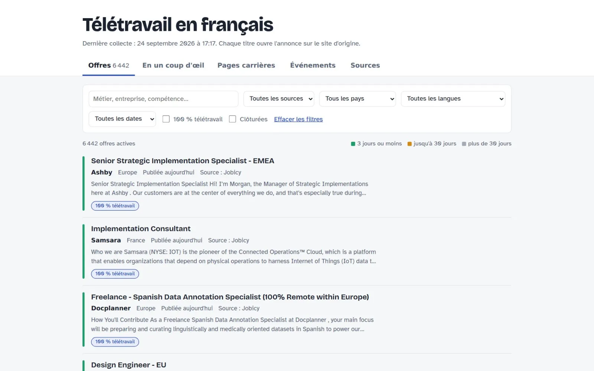
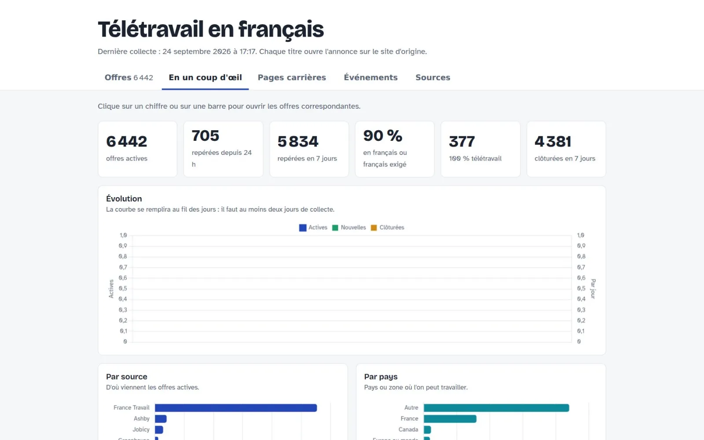

  
  

<h1 align="center">Télétravail en français</h1>

<b>Toutes les offres en télétravail pour francophones, au même endroit.</b> Un tableau de bord qui rassemble, trie et suit les offres en télétravail ouvertes aux francophones. Mis à jour tout seul, toutes les six heures.

Statut : <b>En ligne</b>

---

### Le problème

Les offres en télétravail sont éparpillées entre sites d'emploi, pages carrières et plateformes étrangères — et beaucoup ne disent même pas si le français est un atout.

### L'idée

Un robot qui fait la tournée à ma place : il collecte, dédoublonne, repère la langue et classe les offres. Il ne reste qu'à filtrer.

### Comment c'est fait

Un script Python lancé par GitHub Actions interroge des sources publiques et les pages carrières de centaines d'entreprises, puis publie une page statique avec filtres et graphiques.

**Outils** &nbsp; `Python` `GitHub Actions` `API France Travail` `Remotive`

### Aperçu

 

### Mentions

Chaque offre renvoie vers l'annonce d'origine. Sources : API France Travail, Remotive, Jobicy, Le Forem, chacune soumise à ses propres conditions d'utilisation.

### English

**Télétravail en français** — *Every remote job for French speakers, in one place.* A dashboard that gathers, sorts and tracks remote jobs open to French speakers. It updates itself every six hours.

Remote jobs are scattered across job boards, career pages and foreign platforms — and many don't even say whether French is a plus. A bot that does the rounds for me: it collects, deduplicates, detects the language and ranks the offers. All that's left is filtering. A Python script run by GitHub Actions queries public sources and the career pages of hundreds of companies, then publishes a static page with filters and charts.

---

Conçu, développé et mis en ligne par <b>Senshi Kabai</b>, Product Builder · <a href="https://www.senshicore.com/">portfolio</a> · <a href="https://www.senshicore.com/projets/teletravail/">fiche du projet</a> © 2026 Senshi Kabai — tous droits réservés.

<b>Documentation technique</b> · notes de développement et de mise en ligne

## Télétravail en français (projet perso)

Page statique sur GitHub Pages. Une GitHub Action collecte les offres toutes les 6 heures,
écrit les fichiers de `data/`, et la page les affiche en 5 onglets : Offres, En un coup d'œil,
Pages carrières, Événements, Sources. Chaque offre renvoie vers l'annonce d'origine.

### Mettre à jour depuis la version 1

Remplace tous les fichiers du dépôt par ceux de cette archive (garde ton dossier `data/`, il sera complété),
puis lance *Actions → Mise à jour des offres → Run workflow*. La première collecte prend quelques minutes :
elle teste chaque entreprise de `companies.json` sur six outils de recrutement.

### Sources

| Source | Ce qu'elle apporte | Réglage |
|---|---|---|
| France Travail, Offres d'emploi | Offres françaises mentionnant le télétravail | secrets `FT_CLIENT_ID` et `FT_CLIENT_SECRET` |
| France Travail, Mes évènements emploi | Salons et job datings, dont en ligne | ajouter l'API à ton application ; URL et scope dans `config.json` |
| Le Forem (Belgique) | Offres wallonnes en télétravail, open data officiel | `config.json` → `forem` |
| Jobicy | Offres remote ouvertes en France, Belgique, Suisse, Canada, Europe | `config.json` → `jobicy_geos` |
| Remotive | Offres remote internationales | aucun |
| Pages carrières | Offres publiées directement par les entreprises | `companies.json` |

### Pages carrières

Ajoute l'identifiant d'une entreprise dans `a_detecter` de `companies.json`. L'identifiant se trouve dans l'URL
du bouton « Postuler » : `jobs.lever.co/IDENTIFIANT`, `job-boards.greenhouse.io/IDENTIFIANT`,
`jobs.ashbyhq.com/IDENTIFIANT`, `IDENTIFIANT.recruitee.com`, `apply.workable.com/IDENTIFIANT`,
`jobs.smartrecruiters.com/IDENTIFIANT`.

Le résultat s'affiche dans l'onglet « Pages carrières ». Vérifie le nom de l'entreprise détectée : un identifiant
court peut correspondre à une autre société sur un autre outil. Dans ce cas, place-le dans la liste de son vrai
outil (par exemple `"lever": ["qonto"]`) et retire-le de `a_detecter`.

### Offres à l'étranger pour francophones

Une offre est gardée si elle est en télétravail et remplit au moins une condition :
- l'annonce est rédigée en français ;
- l'annonce, même en anglais, exige le français (« fluent in French », « bilingue », etc.) ;
- le poste est ouvert à un pays francophone, à l'Europe ou au monde entier.

Filtre « Français exigé dans l'annonce » dans l'onglet Offres pour voir les postes étrangers qui recherchent des francophones.

### Clôture des offres

- Flux complets (Remotive, pages carrières) : une offre qui disparaît est clôturée au passage suivant.
- Recherches limitées (France Travail au-delà de 3 000 résultats, Jobicy, Le Forem) : clôture après 3 jours sans être revue.
- Source en erreur : aucune clôture.
- Les clôturées restent visibles 14 jours (case « Clôturées »).

### Si une source affiche une erreur

L'onglet « Sources » montre le détail de la dernière collecte. Les connecteurs France Travail « Événements »
et Le Forem n'ont pas pu être testés en conditions réelles : si l'un d'eux échoue, copie le message d'erreur.

### Bon à savoir

- La page GitHub Pages est publique, même pour un usage perso. La balise `noindex` la tient hors de Google.
- GitHub peut désactiver les workflows planifiés après 60 jours sans activité : réactive-le dans *Actions*.

